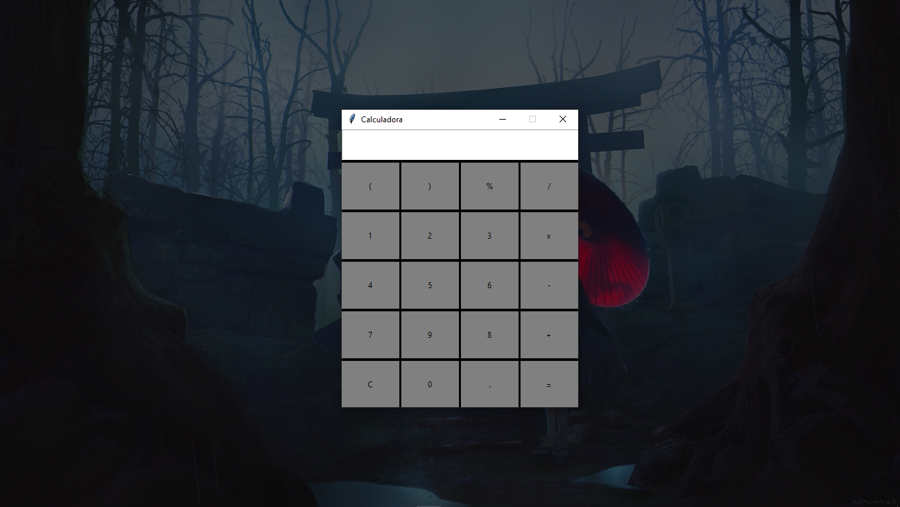

# Calculadora em Python com GUI

## Descrição

Projeto feito em Python. Uma calculadora simples com Interface Gráfica (GUI), nativa em Tema Escuro.

## Algumas Imagens Abaixo

<b>Calculadora sem Cálculos</b>

<b>Dando Input do Cálculo Desejado</b>

<b>Resultado do Cálculo</b>

## Info da Package Importada

~~~py
from tkinter import Tk
~~~

Tkinter é um Module ou Package para o Python. Módulo para criação de aplicativos com Interface Gráfica, sendo possível assim utilizar Botões, Cores, Dimensões, entre outros.
Para saber mais, entre no Link de Info do próprio site oficial do Python.
~~~
https://docs.python.org/3/library/tkinter.html
~~~

## Configurações da Janela

Alterar o título da Janela ->

~~~py
master.title("Nome da Janela")
~~~

Alterar as dimensões da Janela ->

~~~py
master.geometry('1920x1080+0+0')
~~~

Configurar o fundo da Janela ->

~~~py
master.config(bg='black')
~~~

Configurar se é possível redimensionar a Janela com mouse ou não ->

~~~py
master.resizable(False,False)
~~~

## Configurações dos Botões

#### Alterar Tamanho -> width=,height=
#### Alterar Cor do Fundo -> bg=''
#### Alterar Posição -> .place(x=,y=)

~~~py
Button(width=11,height=4,text='+',relief='flat',bg='gray',command=lambda:self.show('+')).place(x=270 ,y=275)
~~~
