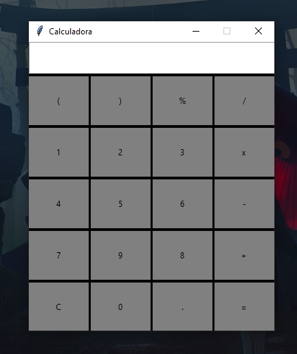
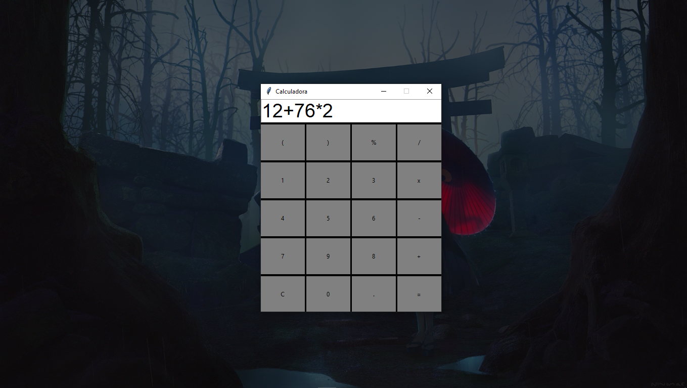
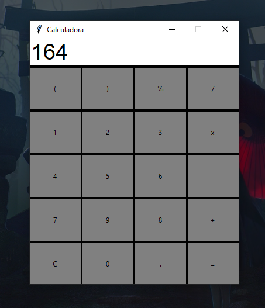

# Calculadora em Python com GUI

## Descrição

Projeto feito em Python. Uma calculadora simples com Interface Gráfica (GUI), nativa em Tema Escuro.

### Algumas Imagens Abaixo

<b>Calculadora sem Cálculos</b>

<b></b>

<b></b>

